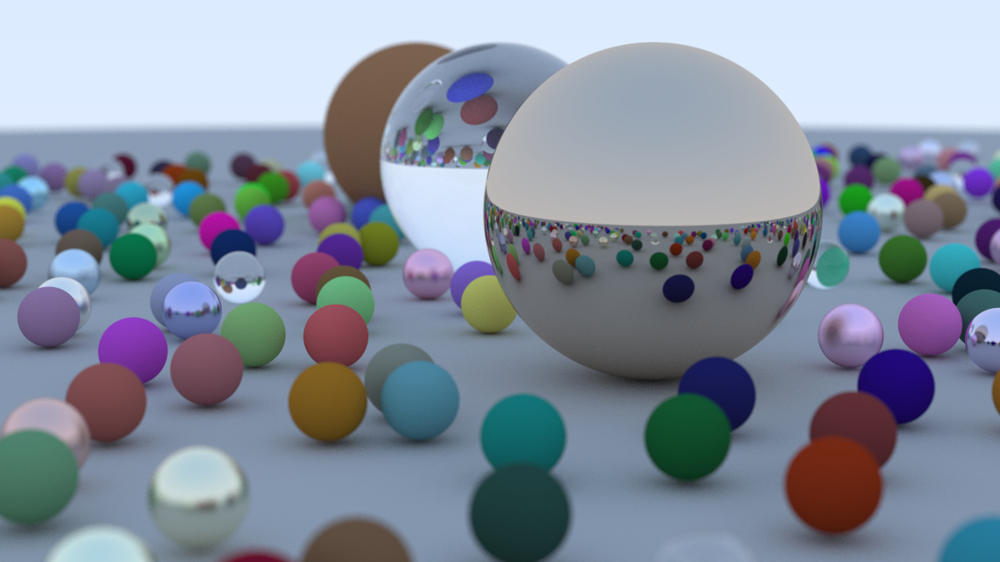
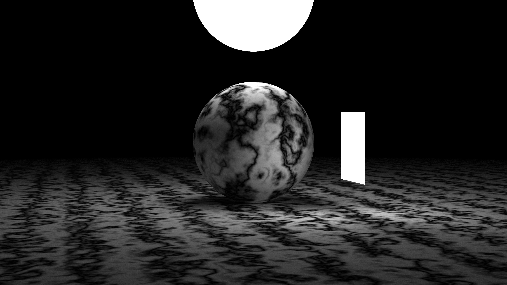
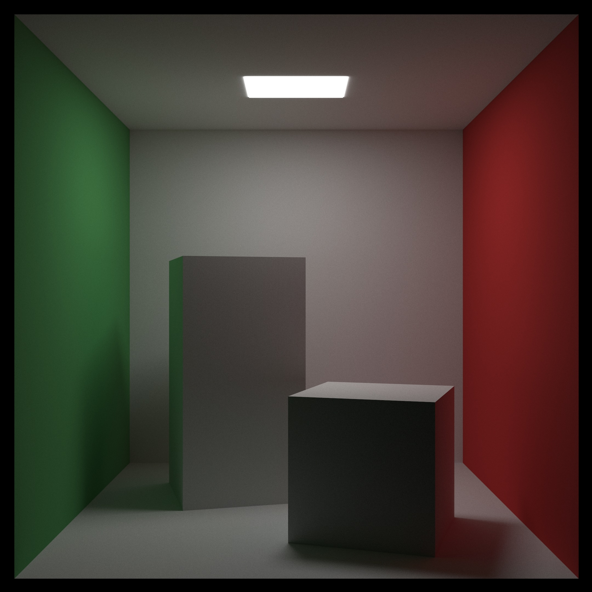

## Ray Tracing in One Weekend: Series

My C99 implementations of [Ray Tracing in One Weekend](https://raytracing.github.io/books/RayTracingInOneWeekend.html)
and [Ray Tracing: The Next Week](https://raytracing.github.io/books/RayTracingTheNextWeek.html)
by Peter Shirley, Trevor David Black, Steve Hollasch. My implementation uses
tagged unions rather than polymorphism.

## Usage

You can render the scenes below as follows:

```sh
cd ray_tracing_in_one_weekend # or ray_tracing_the_next_week
./scripts/build_release
./build/release/main > image.ppm
open image.ppm
```

The ray tracer is single-threaded so it will take about an hour to render the
first scene and about three hours to render the second scene. You can speed it
up by by reducing `image_width` or the number of `samples_per_pixel` in the
main function, or by choosing a different scene from the list available.

## Renders


<p align="center"><em>The final image from 'Ray Tracing in One Weekend'</em></p>

<br/><br/>


<p align="center"><em>The final image from 'Ray Tracing: The Next Week'</em></p>

<br/><br/>


<p align="center"><em>The 'simple light' image demonstrating Perlin noise</em></p>

<br/><br/>


<p align="center"><em>The reference 'Cornell Box' image</em></p>

